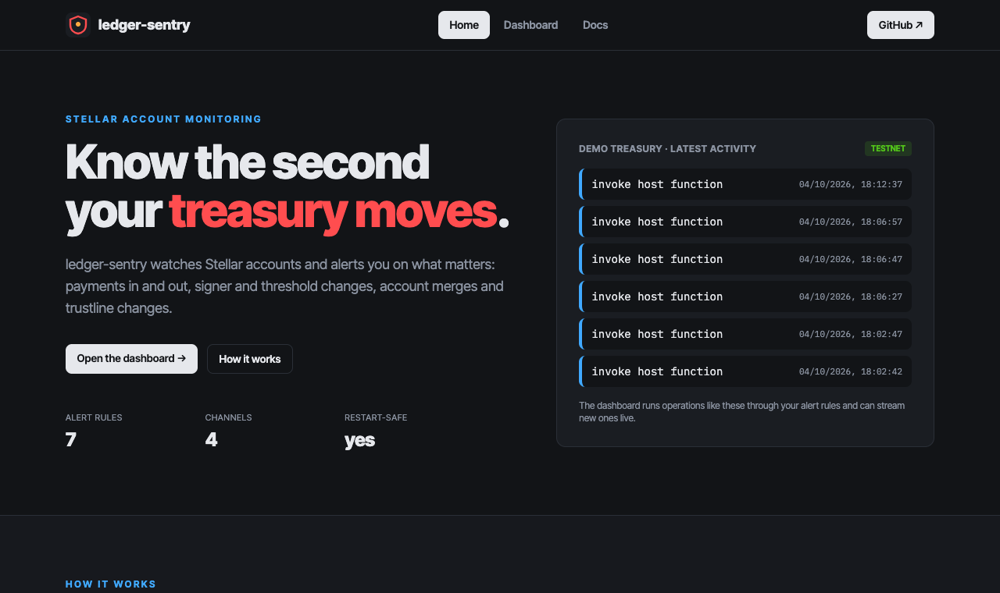
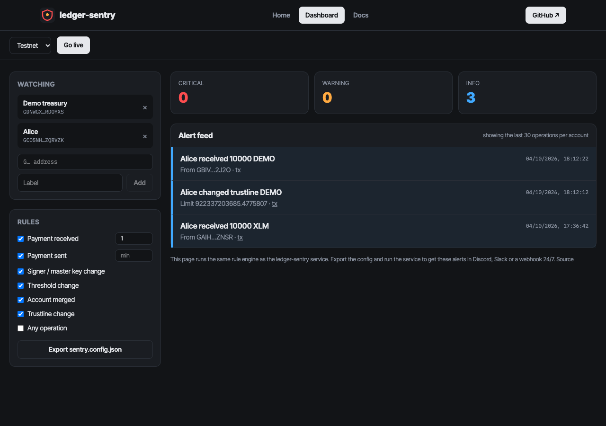

# ledger-sentry

**Real-time alerts for your Stellar accounts.**

`ledger-sentry` streams every operation on the accounts you care about
(treasuries, hot wallets, issuing accounts, customer deposit addresses)
and sends an alert to Discord, Slack, a webhook or the console the moment
something matches your rules. It's built to catch the events that
matter before it's too late: a new signer, a disabled master key, an
account merge, an unexpected outgoing payment.

```text
🔴 Treasury: signer added
GDX7…Q4KA now has weight 10
https://stellar.expert/explorer/public/tx/9f3c…
```

## Quick start

```bash
# not published to npm yet: install from source
git clone https://github.com/Derinsolababy/ledger-sentry && cd ledger-sentry
npm install && npm run build && npm link   # puts `ledger-sentry` on your PATH

cp sentry.config.example.json sentry.config.json
export DISCORD_WEBHOOK_URL=https://discord.com/api/webhooks/…
ledger-sentry sentry.config.json
```

## Configuration

```json
{
  "horizonUrl": "https://horizon.stellar.org",
  "explorerTxUrl": "https://stellar.expert/explorer/public/tx/{hash}",
  "cursorFile": ".sentry-cursors.json",
  "stallCheckMinutes": 5,
  "healthPort": 8787,
  "accounts": [{ "address": "GBRP…OX2H", "label": "Treasury" }],
  "rules": [
    { "type": "payment_received", "minAmount": 100 },
    { "type": "payment_sent", "asset": "USDC" },
    { "type": "signer_change" },
    { "type": "threshold_change" },
    { "type": "account_merge" },
    { "type": "trustline_change" }
  ],
  "notifiers": [
    { "type": "console" },
    { "type": "discord", "webhookUrl": "${DISCORD_WEBHOOK_URL}" },
    { "type": "slack", "webhookUrl": "${SLACK_WEBHOOK_URL}", "minSeverity": "critical", "digestMinutes": 1440 },
    { "type": "telegram", "botToken": "${TELEGRAM_BOT_TOKEN}", "chatId": "${TELEGRAM_CHAT_ID}" },
    { "type": "webhook", "url": "https://ops.example/alerts", "headers": { "authorization": "Bearer ${OPS_TOKEN}" } }
  ]
}
```

`${VAR}` references are filled in from the environment, so webhook URLs
and tokens never have to live in the file. The config is validated at
startup with clear error messages (bad addresses, unknown rules, non-https
webhooks).

### Notifiers

`console`, `discord`, `slack`, `telegram` (Bot API `botToken` + `chatId`) and `webhook` (raw alert JSON, optional headers). Every notifier also accepts:

- `minSeverity` (`info` | `warning` | `critical`): alerts below it aren't sent right away.
- `digestMinutes`: with `minSeverity`, the lower-severity alerts are collected and sent as one digest message every N minutes (e.g. critical alerts instantly, a daily digest of payments). Pending digests are flushed on shutdown.

### Rules

| Rule | Fires when | Severity |
| --- | --- | --- |
| `payment_received` | The account receives a payment, path payment or is funded (`minAmount`, `asset` filters) | info |
| `payment_sent` | The account sends one | warning |
| `signer_change` | A signer is added or removed, or the master key weight changes | critical |
| `threshold_change` | Signing thresholds change | critical |
| `account_merge` | The account is merged away | critical |
| `trustline_change` | A trustline is added, changed or removed | info |
| `any_operation` | Anything happens (handy for low-traffic cold wallets) | info |

## Reliability

- **No missed or duplicate alerts across restarts.** The last processed
  paging token per account is saved (atomically) to `cursorFile`, and
  streams resume from it.
- **Ordered per account.** Operations are handled strictly in sequence.
- **Retries with backoff** for 5xx and network errors. 4xx responses
  aren't retried, since retrying a misconfigured webhook won't help.
- **One broken channel doesn't silence the rest.** Each notifier fails
  independently and the error is logged.
- **One alert per operation.** A payment between two watched accounts reaches both streams but alerts once.
- **Stall detection.** Every `stallCheckMinutes` (default 5, `0` disables) each stream is compared with Horizon's latest operation for the account; if Horizon is ahead and nothing has arrived for a minute, the stream is restarted from the saved cursor.
- **Health check.** With `healthPort`, `GET /health` returns per-account cursor, last event, restarts and stall state (HTTP 503 while a stream is stalled), for uptime monitors.
- Streams reconnect automatically, and SIGINT/SIGTERM shut down cleanly.

## Use it as a library

```ts
import { evaluate, notify } from "ledger-sentry";

const alerts = evaluate(horizonOperationRecord, { address, label: "Hot wallet" }, rules);
for (const alert of alerts) await notify(alert, notifiers);
```

## Development

```bash
npm install
npm test        # 24 tests: rules, notifiers, config, cursors
npm run lint && npm run typecheck && npm run build
```

## Web app



The site has three pages: **Home** (what it does, with live testnet data), **App** (the tool itself) and **Docs** (getting started, concepts, reference and FAQ).



A live monitoring dashboard at `web/`, running the service's own rule engine in the browser:

- **Watchlist**: add any accounts with labels (testnet or mainnet), saved in your browser.
- **Rules**: toggle each rule and set minimum amounts for payment alerts.
- **Alert feed**: replays each account's last 30 operations through the rules, then **Go live** streams new operations from Horizon as they happen. Counters for critical, warning and info.
- **Export config**: generates the matching `sentry.config.json`, so you can run the service 24/7 with Discord, Slack or webhook delivery.

```bash
cd web
npm install
npm run dev        # http://localhost:5173
```

The app imports the library straight from `../src`, so the browser and the CLI
share one implementation. `netlify.toml` at the repo root deploys it as-is.

## Documentation

- [Architecture](docs/architecture.md)
- [Deployment](docs/deployment.md)
- [Contributing](CONTRIBUTING.md) · [Security policy](SECURITY.md) · [Changelog](CHANGELOG.md)

## Glossary (new to Stellar?)

- **Horizon**: Stellar's HTTP API server. It can *stream* new operations
  as they happen using Server-Sent Events.
- **Operation**: a single action inside a transaction: a payment, a
  trustline change, an options change and so on.
- **Paging token / cursor**: Horizon's bookmark for "everything after
  this point". Saving it is what lets ledger-sentry resume exactly.
- **Signer / master key / thresholds**: who can sign for an account and
  how much signing weight each action needs. Changes here are how
  account takeovers happen, so they're always critical.
- **Account merge**: deletes an account and moves all its XLM elsewhere.
- **Trustline**: an account's opt-in to hold a non-XLM asset.

## License

MIT
